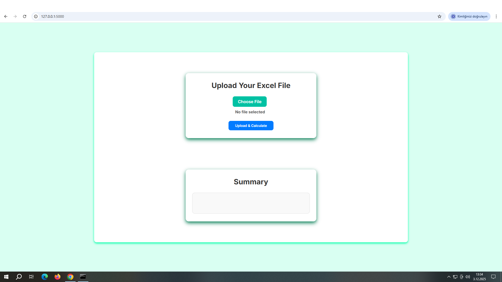
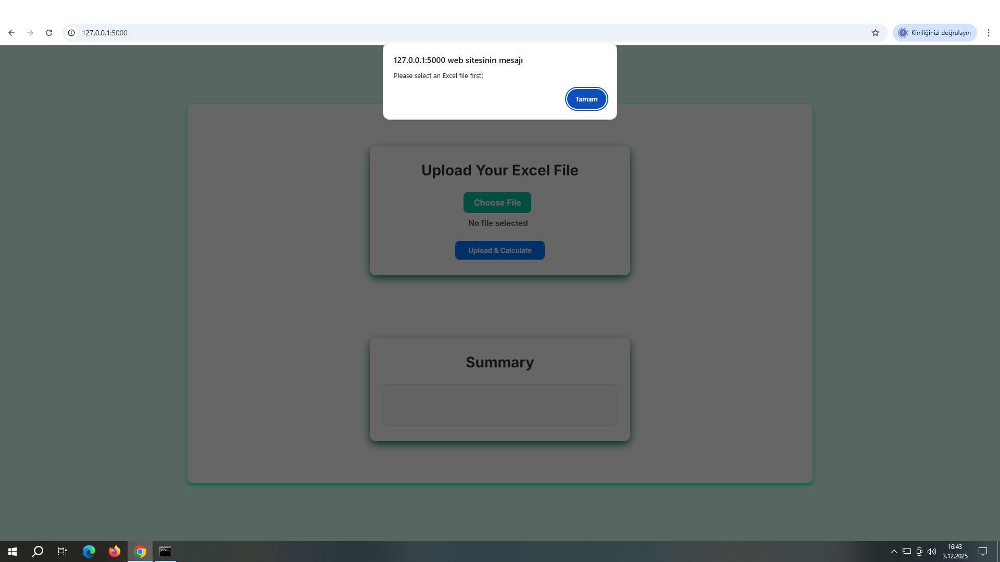
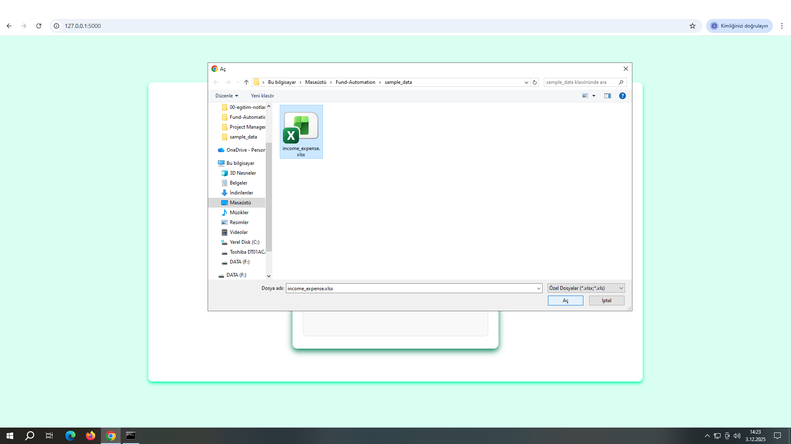
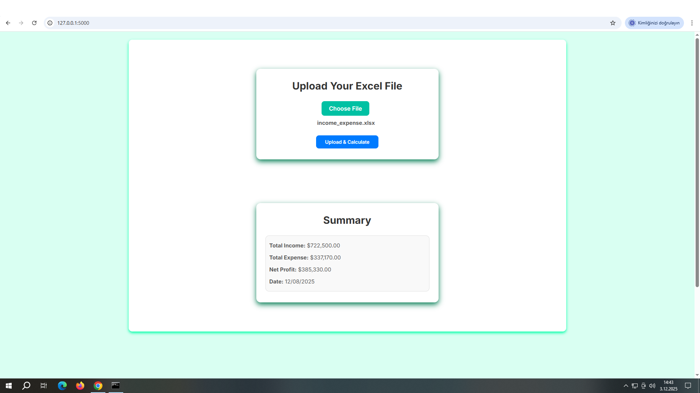
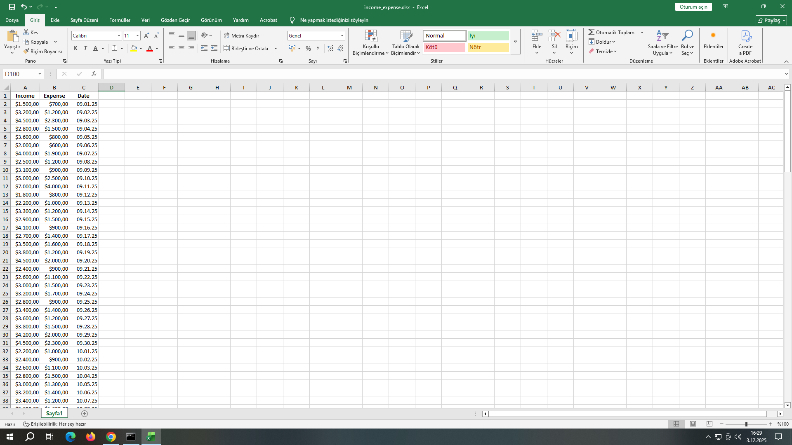
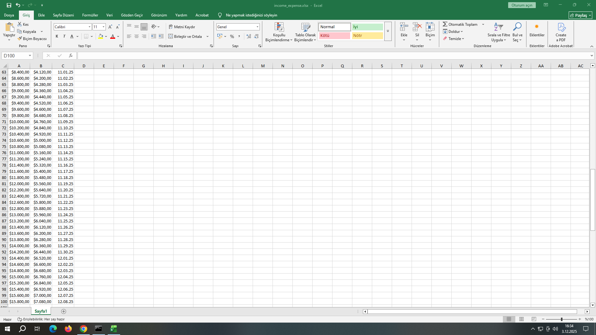

# FUND - AUTOMATION

This project is a calculation and validation system designed to automatically process income, expense, and date data stored in an Excel file by any company or individual.

 

The user simply uploads their own Excel file. The system then performs the following operations in the background:

  

- Automatic Calculation -

 

Reads all income and expense values

Automatically calculates total income, total expenses, and net profit

Extracts the most recent date from the dataset.

  

- PDF Export -

Allows users to download a professionally formatted PDF report containing all calculated results.

  

- Error Detection & Validation -

 

If the user accidentally enters incorrect or invalid data into the Excel file, such as:

Invalid text

Incompatible numeric values

Missing or invalid dates

Empty or malformed fields

the system automatically detects these issues.

 

**In the interface it displays warnings including:**

The row number containing the error

The column name

The invalid value entered

This enables the user to easily locate and correct mistakes directly in the Excel file.

The only thing the user needs to do is enter their Date, Income, and Expense data into the Excel file.

The system handles everything else fully automatically.

  

**NOTE:** This project operates in the background through a combination of jQuery-Ajax on the frontend and Python Flask backend functions, ensuring that all data is processed and transferred correctly.

 

  

# ALERT

If the Upload & Calculate button is clicked without selecting a file after logging into the system an alert message saying "Please select an Excel file first!" will appear indicating an invalid action. File selection must be done first.

 

  

# EXCEL SELECT

To see your own work you must click the Choose File button and then select your Excel file from your computer.

 

  

# FILE CALL

When your own Excel file is selected it appears under the Choose File button and is loaded into the system.

 

  

# UPLOAD & CALCULATE

After clicking the Upload & Calculate button by adding only the numbers under Income and Expense in the Excel file and including the date for each entry we can see the date from the last row as well as the net profit, total income, and total expenses in the summary 

list. Our system calculates and displays the profit in the background even if the Excel file has 100 rows or more and the calculations are complex. There is no need to write the profit in the Excel file the system does it automatically.

 

  
